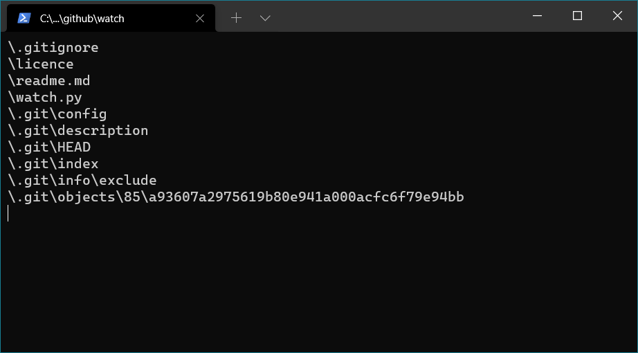

# Watch
watch a given directory for file changes using the command line, useful for demos



## Usage
```ps
# watch the current directly
$ watch.py

# specify a given directory to watch
$ watch.py ~/code/project/
```