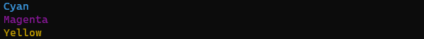

# Watch
Watch a given directory for file changes using the command line. Useful for demos.


## Usage
```
$ watch.py -h
usage: watch.py [-h] [-k] [-t TICK] [-o] [-c] [path]

positional arguments:
  path                  path to watch, otherwise use working directory

optional arguments:
  -h, --help            show this help message and exit
  -k, --keep            keep deleted files on-screen
  -t TICK, --tick TICK  time we'll wait to print directory out after a change
  -o, --omit-dirs       hide directories from the output (default behaviour is show)
  -c, --colourless      disable the colour rendering and file removal delay
```

### Usage Examples
```sh
# invoke watch.py in the current directory with default settings
$ watch.py

# specify a directory to watch
$ watch.py demo

# specify a directory to watch / using ~ character
$ watch.py ~/demo

# specify a directory to watch (full path)
$ watch.py C:\Users\User\github\project-name\

# specify the refresh rate of the folder scan (tick = 5 seconds)
$ watch.py -t 5

# keep the verbose history of deleted files/folders
$ watch.py -k

# custom tick, custom folder and verbose history
$ watch.py "~/code/project/" -k -t 2

# omit directories from the output (showing files/file changes only)
$ watch.py -o

# use colourless mode, less flashing/pausing and no colours, just plain changes only (like v0.1)
$ watch.py -c
```

## Modules
### Colour
The Colour module is used to print words to the terminal/command line in colour as opposed the system default. Leveraging the special TTY colour codes with tested support for windows Terminal we can print several basic colours.

#### Example 1: Print
```py
# we can print a whole string in python using the Colour.print() method:
colour.print("Cyan", Colour.CYAN)
colour.print("Magenta", Colour.MAGENTA)
colour.print("Yellow", Colour.YELLOW)
```


#### Example 2: Convert (In-Line)
```py
# we can edit individual words with the Colour.convert() method:
print("\n...will you take the " + colour.convert("red pill",Colour.LIGHT_RED) + ", or take the " + colour.convert("blue pill",Colour.LIGHT_BLUE) + "?")
```

