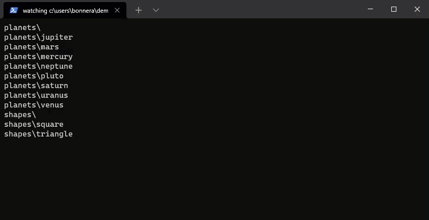

# Watch
Watch a given directory for file changes using the command line. Useful for demos.



## Usage
```
$ watch.py -h
usage: watch.py [-h] [-v] [-t TICK] [path]

positional arguments:
  path                  file path to watch (default: current)

optional arguments:
  -h, --help            show this help message and exit
  -v, --verbose         preserve output
  -t TICK, --tick TICK  clock (refresh) tick rate
```

### Usage Examples
```ps
# invoke watch.py in the current directory with default settings
$ watch.py

# specify a directory to watch
$ watch.py demo

# specify a directory to watch / using ~ character
$ watch.py ~/demo

# specify a directory to watch (full path)
$ watch.py C:\Users\User\github\project-name\

# specify the refresh rate of the folder scan (tick = 5 seconds)
$ watch.py -t 5

# keep the verbose history of deleted files/folders
$ watch.py -v

# custom tick, custom folder and verbose history
$ watch.py "~/code/project/" -v -t 2
```